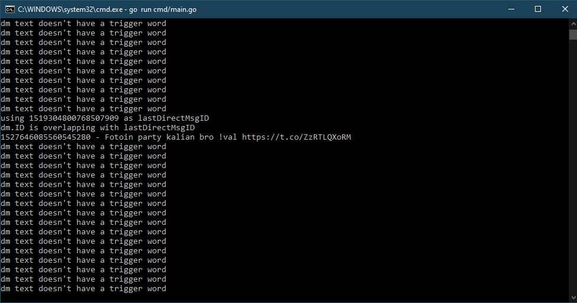

<!-- PROJECT LOGO -->
 

  

  <h3 align="center">Twitter Bot</h3>

  

    Automatic tweet bot from direct dessage!
     
    <a href="https://github.com/ghazimuharam/twitter-bot"><strong>Explore the docs »</strong></a>
     
     
    <a href="https://twitter.com/GAMEFESS_">View Demo</a>
    ·
    <a href="https://github.com/ghazimuharam/twitter-bot/issues">Report Bug</a>
    ·
    <a href="https://github.com/ghazimuharam/twitter-bot/issues">Request Feature</a>
  

<!-- TABLE OF CONTENTS -->

  
Table of Contents

  <ol>
    <li>
      <a href="#about-the-project">About The Project</a>
      <ul>
        <li><a href="#built-with">Built With</a></li>
      </ul>
    </li>
    <li><a href="#contact">Contact</a></li>
  </ol>

<!-- ABOUT THE PROJECT -->
## About The Project

(<a href="#top">back to top</a>)

### Built With

This project is heavily dependend on on the development phase

* [Cron](https://github.com/robfig/cron/v3)
* [Go-cache](https://github.com/patrickmn/go-cache)
* [Go-twitter](https://github.com/ghazimuharam/go-twitter)
* [OAuth1](https://github.com/dghubble/oauth1)
* [Viper](github.com/spf13/viper)
* [Wire](https://github.com/google/wire)

(<a href="#top">back to top</a>)

<!-- CONTACT -->
## Contact

Ghazi Muharam - [@ghzxmhrm](https://twitter.com/ghzxmhrm) - ghzmhrmdev@gmail.com

Project Link: [https://github.com/ghazimuharam/twitter-bot](https://github.com/ghazimuharam/twitter-bot)

(<a href="#top">back to top</a>)

